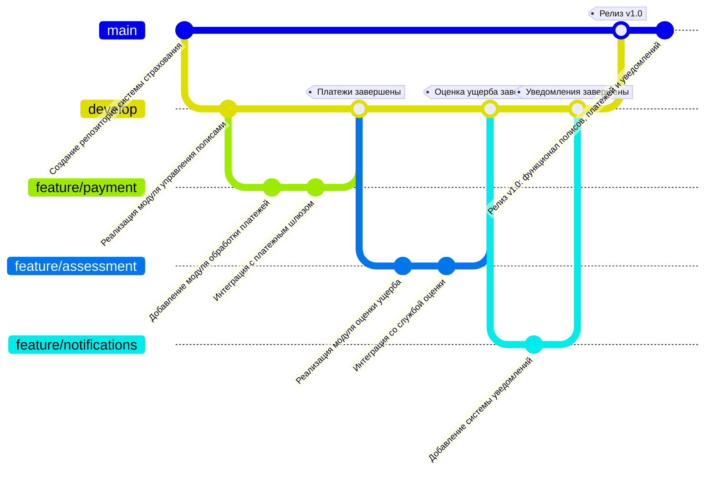
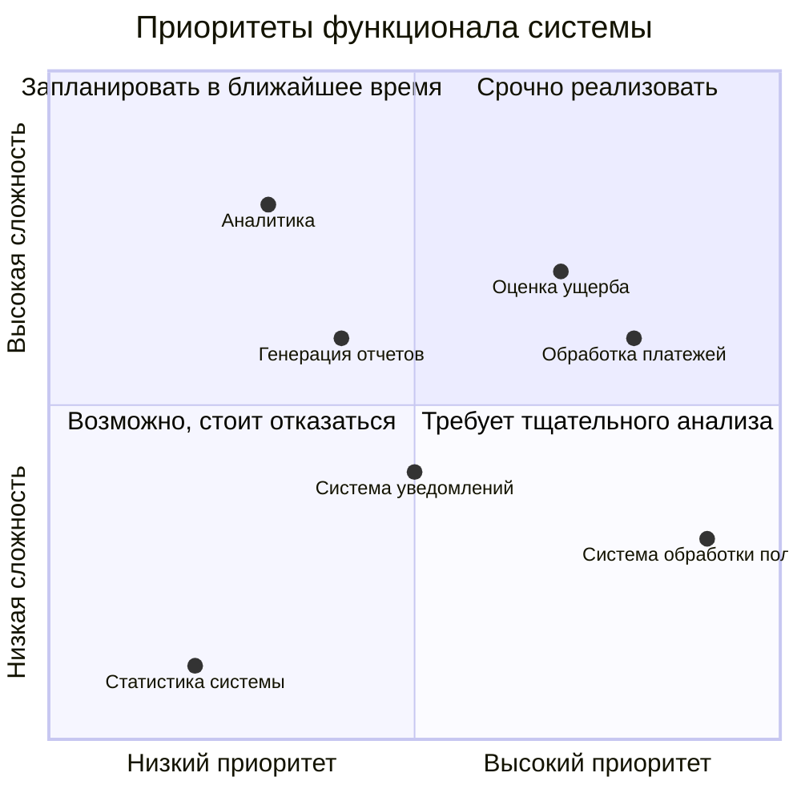
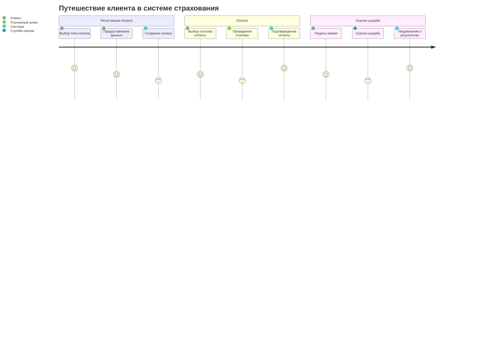
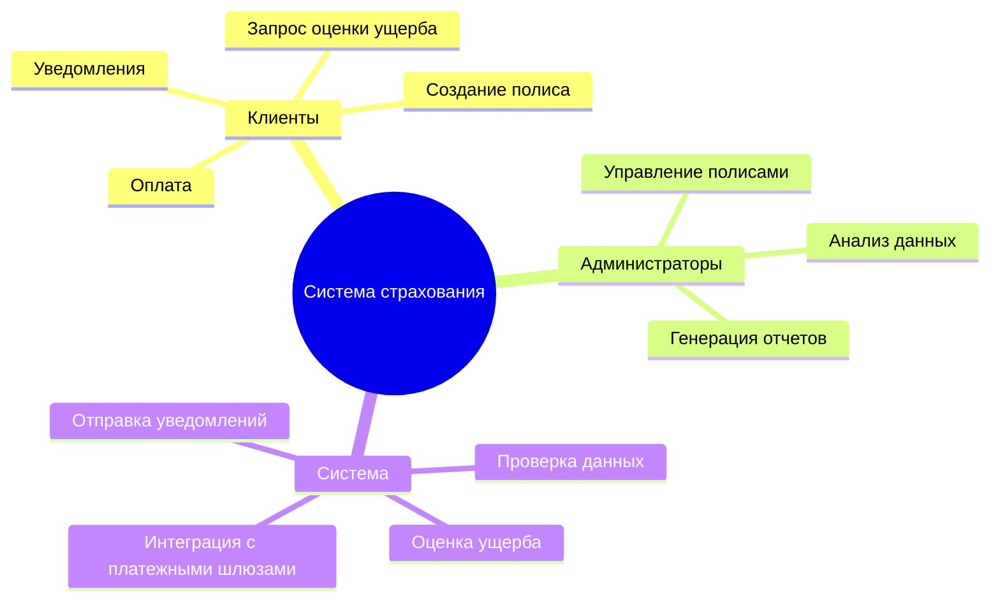

# Информационная система страхования

Данный проект представляет собой клиент-серверную информационную систему для управления страховыми полисами, оплатами и оценкой ущерба.

---

## GitGraph
Первым на рассмотрении будет GitGraph. С его помощью можно отобразить базовый процесс работы с разными ветками при разработке системы. Такой граф является более наглядным в сравнение с ручным разбором истории коммитов.

---
## Квадрант-граф
Следующим на рассмотрении идет Квадрант-граф. Он позволяет классифицировать задачи по разным критериям, например, высокая/низкая сложность и высокий/низкий приоритет. Данный подход удобен, когда в момент разработки возникает несколько задач и команда не сразу понимает за что браться. Данный граф помогает оценить каждую задачу и сфокусировать внимание на самых важных. Пример такого графа представлен выше.

---
## User Journey Diagram
Третьим по очереди, но не по значению можно выделить User Journey Diagram. Данная диаграмма позволяет оценить пользовательский опыт при взаимодействии с каждым элементом нашей системы и выявить слабые места. 

---
## Mind Map
И наконец последняя диаграмма – Mind Map. Данные диаграммы можно использовать для визуализации ключевых аспектов клиент-серверной системы, которые можно сгруппировать по ролям. 

